liesure research
================

**여가활동 인원과 만족도의 상관관계** (부제: 우리는 혼자여서 행복한가?)
=======================================================================

Ⅰ. 도입
-------

### 1. 요약(초록)

해당 분석에서는 2015년 서울시민의 삶을 여가를 통해 알아보고자 하였다. 그중 가장 집중했던 요소는 여가에 참여하는 인원으로 첫 번째로 여가 인원에 따른 만족도 차이를 분석하였다. 다음으로는 첫 번째 분석의 결과가 나이에 따라 달라질 것이라 예상하고 나이와 여가 만족도의 관계를 분석하고, 또 이를 연령대로 구분하여 분석해보았다. 다른 측면에서는 참여한 여가활동의 종류 또한 만족도에 영향을 미칠 것이라 판단하여 참여한 1순위 여가 종류별 만족도를 분석해보았다. 최종적으로는 연령대 및 여가 인원별 만족도 차이와 성별 및 여가 인원별 만족도 차이를 분석했다. 분석 결과, 다양한 변수 모두 여가 만족도에 큰 영향을 주지 못하는 것으로 드러났다.

### 2. 분석 주제

데이터가 된 2015 서울 복지 실태조사만 보아도 1인 가구가 전체의 4분의 1에 달할 정도로 우리는 혼자에 익숙해지고 있다. 이는 단순히 가구의 형태에 한정된 현상이 아니라 혼영, 혼술 등 홀로 즐기는 일상이 하나의 문화로 자리 잡기에 이르렀다. 자발적으로 삶을 즐기는 이들은 혼자가 좋고 혼자가 편하다는 것을 이유로 들곤 한다. 하지만 이러한 라이프 스타일은 과거에는 ‘이상하게’ 인식되기도 하였는데, 때문에 분석자는 실제로 우리가 혼자일 때 행복한가에 대한 의구심을 가지게 되었고 이를 여가 인원에 따른 만족도를 통해 알아보고자 하였다.

------------------------------------------------------------------------

Ⅱ. 분석 및 해석
---------------

### 1. 분석 목적 및 방법

가장 핵심이 된 변수는 `D13. 여가활동 함께하는 사람`과 `F1-7). 생활영역 만족도_여가생활(여가시설, 여가활동, 문화생활 등)`로 이들을 통해 여가 인원에 따른 만족도 차이를 분석하였다. 또 나이별, 연령대별, 여가 종류별(`D12. 최근 참여한 여가활동_1순위` 변수 이용) 만족도 차이를 알아보았다. 궁극적으로는 이 다양한 변수들이 여가 인원에 따른 만족도에 미치는 영향을 무시할 수 없다 생각하여 연령대와 여가 인원별로 집단을 나누어 '연령대 및 여가 인원 만족도 차이'를 구하였고 성별, 여가 인원별로 집단을 나누어 '성별 및 여가 인원별 만족도'를 분석하였다.

### 2. 데이터 분석 준비하기

#### 패키지 로드하기

``` r
library(readxl)
library(dplyr)
library(ggplot2)
```

#### 데이터 불러오기

``` r
data <- read_excel("2015data.xlsx")
```

본격적인 전처리에 앞서 데이터 원본 대신 사본을 만들어 이용한다.

``` r
welfare <- data
```

#### 변수명 바꾸기

변수 검토 전 분석에 사용할 7개의 변수의 이름을 쉬운 단어로 바꿨다.

``` r
welfare <- rename(welfare,
                  leisure1 = D12_1,
                  whowith = D13,
                  satisfy = F1_7,
                  birth1 = A1_4_1_1,
                  birth2 = A1_4_1_2,
                  sex1 = A1_3_1,
                  sex2 = A1_3_2)
```

### 3. 데이터 분석 및 해석

분석을 하는 데 필요한 준비가 끝났으니 이제 앞에서 선정한 변수들을 이용해 여가와 만족도에 관한 여러 가지 분석을 할 것이다. 분석은 두 단계 절차(1. 변수 검토 및 전처리, 2. 변수 간 관계 분석)로 진행한다.

### \[분석0\] 여가 동반인에 따른 만족도 차이

#### 변수 검토 및 전처리

-   여가 동반인 변수

``` r
class(welfare$whowith)
```

    ## [1] "numeric"

``` r
welfare$whowith <- ifelse(welfare$whowith == 1, "혼자", 
                          ifelse(welfare$whowith == 2, "가족", 
                                 ifelse(welfare$whowith == 3, "친구", 
                                        ifelse(welfare$whowith == 4, "직장동료", "기타"))))
table(welfare$whowith)
```

    ## 
    ##     가족     기타 직장동료     친구     혼자 
    ##     1187       86       97      829      820

``` r
#이상치 확인 
table(is.na(welfare$whowith))
```

    ## 
    ## FALSE 
    ##  3019

``` r
qplot(welfare$whowith)
```

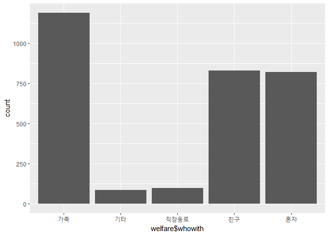

-   만족도 변수

``` r
class(welfare$satisfy)
```

    ## [1] "numeric"

``` r
table(welfare$satisfy)
```

    ## 
    ##    1    2    3    4    5 
    ##   29  280  926 1366  401

``` r
summary(welfare$satisfy)
```

    ##    Min. 1st Qu.  Median    Mean 3rd Qu.    Max.    NA's 
    ##    1.00    3.00    4.00    3.61    4.00    5.00      17

``` r
qplot(welfare$satisfy)
```

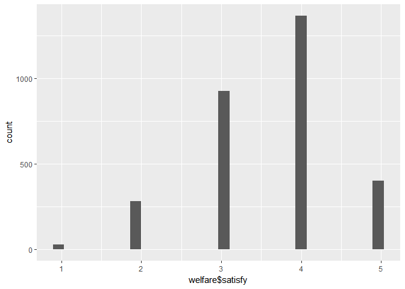

#### 변수 간 관계 분석: 여가 동반인과 만족도

``` r
who_satis <- welfare %>% 
  filter(!is.na(satisfy)) %>% 
  group_by(whowith) %>% 
  summarise(mean_satis = mean(satisfy))
#여가 동반인별 만족도 표
who_satis
```

    ## # A tibble: 5 x 2
    ##   whowith  mean_satis
    ##   <chr>         <dbl>
    ## 1 가족           3.75
    ## 2 기타           3.60
    ## 3 직장동료       3.67
    ## 4 친구           3.59
    ## 5 혼자           3.43

``` r
#여가 동반인별 만족도 그래프
ggplot(data = who_satis, aes(x = whowith, y = mean_satis)) + 
  geom_col(aes(fill = factor(whowith)))
```

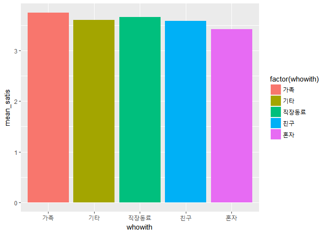

``` r
#여가 동반인별 만족도 그래프 확대
ggplot(data = who_satis, aes(x = whowith, y = mean_satis)) + 
  geom_col(aes(fill = factor(whowith))) +
  coord_cartesian(ylim = c(3, 4))
```

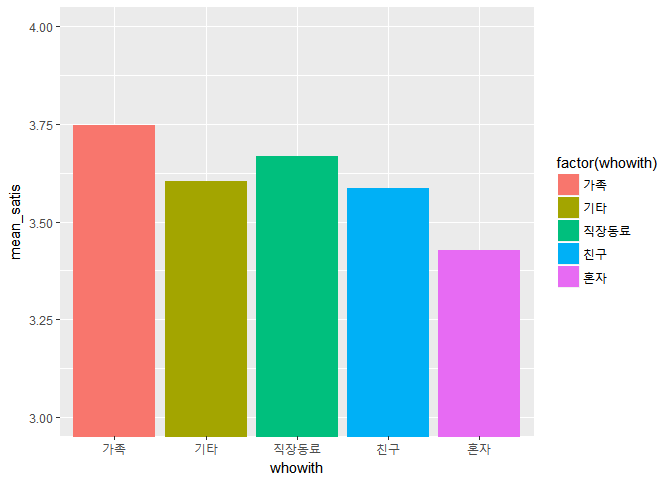

\[분석0\] 결과 여가 동반인이 누군지에 따른 만족도를 비교해보았을 때 여가동반인은 만족도에 큰 영향을 주지 못하는 것으로 밝혀졌다. 그리고 오히려 미세하지만 가족과 함께하였을 때의 만족도가 가장 높았고 혼자 하는 여가의 만족도가 가장 낮게 나타났는데, \[분석1\]에서는 우리의 분석 목적에 더 적절한 방식인 혼자일 때와 아 닐때의 여가 만족도로 나누어 살펴보겠다.

### \[분석1\] 여가 인원에 따른 만족도 차이

#### 변수 검토 및 전처리

-   여가 인원 변수

``` r
welfare <- welfare %>% 
  mutate(aloneornot = ifelse(whowith == "혼자", "alone", "together"))
table(welfare$aloneornot)
```

    ## 
    ##    alone together 
    ##      820     2199

#### 변수 간 관계 분석: 여가 인원과 만족도

``` r
alone_satis <- welfare %>% 
  filter(!is.na(satisfy)) %>% 
  group_by(aloneornot) %>% 
  summarise(mean_satis = mean(satisfy))
#여가 인원별 만족도 표
alone_satis
```

    ## # A tibble: 2 x 2
    ##   aloneornot mean_satis
    ##   <chr>           <dbl>
    ## 1 alone            3.43
    ## 2 together         3.68

``` r
#여가 인원별 만족도 그래프
ggplot(data = alone_satis, aes(x = aloneornot, y = mean_satis)) + 
  geom_col(aes(fill = factor(aloneornot)))
```

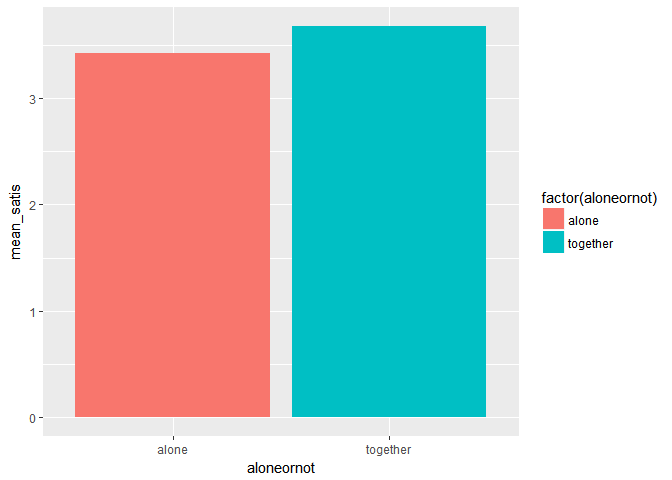

\[분석1\]은 여가 인원이 만족도에 주는 영향을 알아보고자 한 분석이었다. 그러나 표와 그래프로 확인할 수 있듯 \[분석0\]과 마찬가지로 혼자 하는 여가와 다른 사람이 함께하는 여가의 만족도는 큰 차이를 보이지 않았으며 미세한 차이로 혼자 하는 여가의 만족도가 그렇지 않은 경우에 비해 더 낮게 나타났다.

### \[분석2\] 나이와 여가 만족도의 관계

#### 변수 검토 및 전처리

``` r
table(welfare$respondent)
```

    ## 
    ##    1    2    3    4    5    6 
    ## 1574 1407   29    7    1    1

대부분의 응답자가 가구원 번호 1 또는 2에 해당했다. 응답자의 나이를 파악하기 위해 가구원 번호가 1인 응답자의 나이와 가구원 번호가 2인 응답자의 나이를 따로 구하였다. 그 외의 가구원 번호(3~6)를 가진 응답자는 제외하여 계산하였고 이들의 나이는 결측처리하였다.

-   나이 변수

``` r
class(welfare$birth1)
```

    ## [1] "numeric"

``` r
#가구원 번호가 1인 응답자의 출생년도
summary(welfare$birth1)
```

    ##    Min. 1st Qu.  Median    Mean 3rd Qu.    Max. 
    ##    1920    1954    1962    1963    1972    1997

``` r
qplot(welfare$birth1)
```

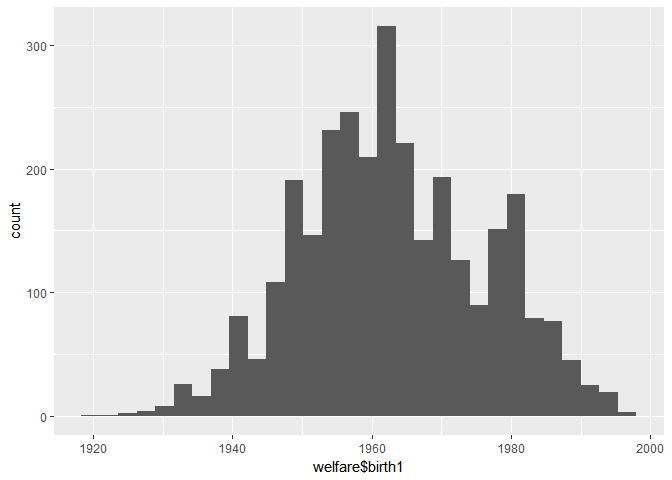

``` r
#결측치 확인
table(is.na(welfare$birth1))
```

    ## 
    ## FALSE 
    ##  3019

``` r
class(welfare$birth2)
```

    ## [1] "numeric"

``` r
#가구원 번호가 2인 응답자의 출생년도
summary(welfare$birth2)
```

    ##    Min. 1st Qu.  Median    Mean 3rd Qu.    Max.    NA's 
    ##    1923    1958    1967    1968    1979    2014     797

``` r
qplot(welfare$birth2)
```

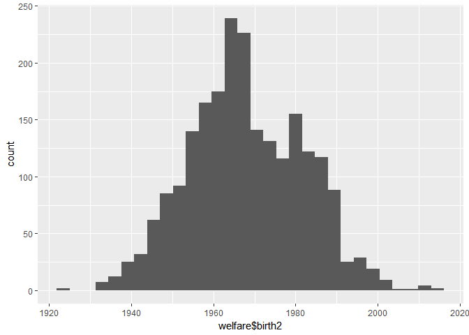

``` r
#결측치 확인
table(is.na(welfare$birth2))
```

    ## 
    ## FALSE  TRUE 
    ##  2222   797

``` r
#응답자 나이 계산
welfare <- welfare %>% mutate(respondent_age = ifelse(respondent == 1, 2018 - birth1 + 1, 
                                                      ifelse(respondent == 2, 2018 - birth2 + 1, NA)))
table(is.na(welfare$respondent_age))
```

    ## 
    ## FALSE  TRUE 
    ##  2981    38

``` r
qplot(welfare$respondent_age)
```

    ## `stat_bin()` using `bins = 30`. Pick better value with `binwidth`.

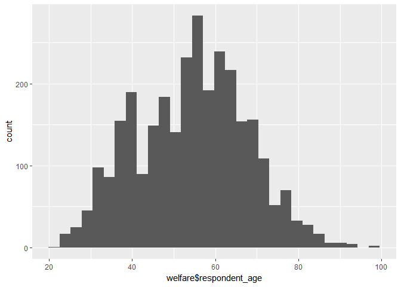

#### 변수 간 관계 분석: 나이와 만족도

``` r
age_satis <- welfare %>% 
  filter(!is.na(respondent_age) & !is.na(satisfy)) %>% 
  group_by(respondent_age) %>% 
  summarise(mean_satis_age = mean(satisfy))
head(age_satis)
```

    ## # A tibble: 6 x 2
    ##   respondent_age mean_satis_age
    ##            <dbl>          <dbl>
    ## 1            22.           4.00
    ## 2            23.           3.00
    ## 3            24.           3.57
    ## 4            25.           3.60
    ## 5            26.           3.17
    ## 6            27.           3.31

``` r
ggplot(data = age_satis, aes(x = respondent_age, y = mean_satis_age)) +
  geom_line()
```

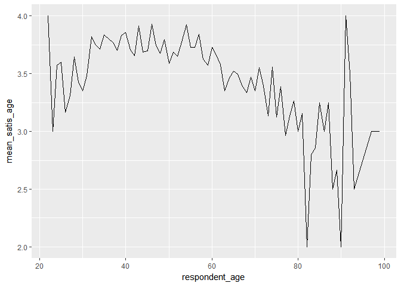

출력된 그래프를 보면 20대 초반에는 높은 여가 만족도를 보이며, 40세까지 증가하는 추세를 보인다. 60세를 기점으로 만족도가 지속적으로 감소하다 90세 즈음 일시적으로 증가하지만 대체적으로 하락하는 양상이다.

### \[분석3\] 연령대에 따른 여가 만족도의 차이

#### 변수 검토 및 전처리

-   연령대 변수

\[분석2\]에서 만든 나이 변수를 이용해 연령대 변수를 만들었다. 앞에서 살펴본 것과 같이 응답자의 나이는 20세에서 100세 사이에 위치하므로 30세 미만을 20대로 지정하였다.

``` r
welfare <- welfare %>% mutate(ageg = ifelse(respondent_age < 30, "20's",
                                            ifelse(respondent_age < 40, "30's",
                                                   ifelse(respondent_age < 50, "40's",
                                                          ifelse(respondent_age < 60, "50's",
                                                                 ifelse(respondent_age < 70, "60's",
                                                                        ifelse(respondent_age < 80, "70's",
                                                                               ifelse(respondent_age < 90, "80's", "90's"))))))))
table(welfare$ageg)
```

    ## 
    ## 20's 30's 40's 50's 60's 70's 80's 90's 
    ##   71  432  537  848  714  302   68    9

``` r
table(is.na(welfare$ageg))
```

    ## 
    ## FALSE  TRUE 
    ##  2981    38

``` r
qplot(welfare$ageg)
```

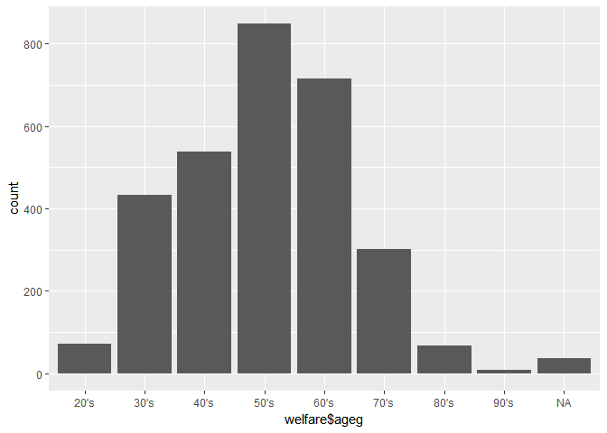

#### 변수 간 관계 분석: 연령대와 만족도

``` r
ageg_satis <- welfare %>% 
  filter(!is.na(satisfy) & !is.na(ageg)) %>% 
  group_by(ageg) %>% 
  summarise(mean_satis_ageg = mean(satisfy))
ageg_satis
```

    ## # A tibble: 8 x 2
    ##   ageg  mean_satis_ageg
    ##   <chr>           <dbl>
    ## 1 20's             3.41
    ## 2 30's             3.75
    ## 3 40's             3.76
    ## 4 50's             3.71
    ## 5 60's             3.51
    ## 6 70's             3.33
    ## 7 80's             2.94
    ## 8 90's             3.00

``` r
ggplot(data = ageg_satis, aes(x = ageg, y = mean_satis_ageg)) +
  geom_col() +
  coord_cartesian()
```

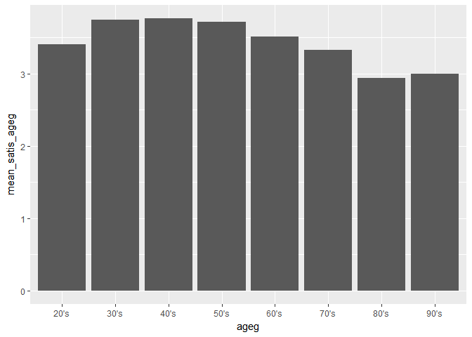

여가 만족도는 연령대에 따라 큰 차이를 보이지 않는 것으로 파악됐다.

### \[분석4\] 연령대 및 여가 인원 만족도 차이

앞에서 검토 및 전처리를 모두 마친 변수이기 때문에 바로 변수 간 관계를 분석하였다.

``` r
leisure_con <- welfare %>% 
  filter(!is.na(satisfy) & !is.na(ageg)) %>% 
  group_by(ageg, aloneornot) %>% 
  summarise(mean_leisure = mean(satisfy))
leisure_con
```

    ## # A tibble: 16 x 3
    ## # Groups:   ageg [?]
    ##    ageg  aloneornot mean_leisure
    ##    <chr> <chr>             <dbl>
    ##  1 20's  alone              3.22
    ##  2 20's  together           3.44
    ##  3 30's  alone              3.59
    ##  4 30's  together           3.78
    ##  5 40's  alone              3.56
    ##  6 40's  together           3.81
    ##  7 50's  alone              3.58
    ##  8 50's  together           3.75
    ##  9 60's  alone              3.37
    ## 10 60's  together           3.58
    ## 11 70's  alone              3.33
    ## 12 70's  together           3.34
    ## 13 80's  alone              2.93
    ## 14 80's  together           2.96
    ## 15 90's  alone              2.80
    ## 16 90's  together           3.33

``` r
ggplot(data = leisure_con, aes(x = ageg, y = mean_leisure, fill = aloneornot)) +
  geom_col(position = "dodge")
```

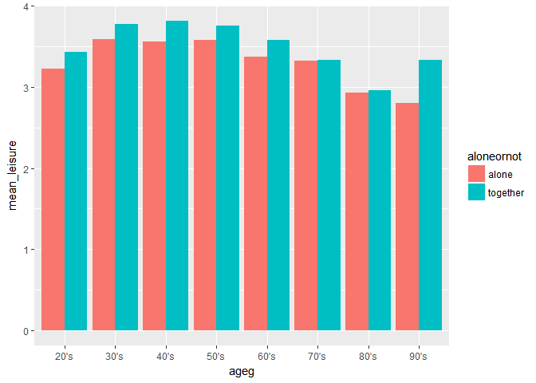

여기서는 연령대와 여가 인원 모두 만족도에 큰 영향을 미치는 변수가 아님을 다시 한 번 확인했는데, 새로이 발견한 사실은 90대에서 특히 함께하는 여가에 대해 높은 만족도를 보였다는 것이다.

### \[분석5\] 여가 종류별 만족도 차이

#### 변수 검토 및 전처리

-   여가 종류 변수

분석 결과를 한눈에 파악할 수 있게 숫자로 나타나있는 여가 종류의 이름이 들어있는 변수를 추가하였다. 여기서는 `최근 참여한 여가활동_1순위` 변수를 이용하였다.

``` r
welfare <- welfare %>% mutate(leisure1_name = ifelse(leisure1 == 1, "휴식",
                                                     ifelse(leisure1 == 2, "문화예술 관람",
                                                            ifelse(leisure1 == 3, "문화예술 참여",
                                                                   ifelse(leisure1 == 4, "스포츠 관람",
                                                                          ifelse(leisure1 == 5, "스포츠 참여",
                                                                                 ifelse(leisure1 == 6, "관광 여행",
                                                                                        ifelse(leisure1 == 7, "취미,오락",
                                                                                               ifelse(leisure1 == 8, "사회 활동","기타")))))))))
class(welfare$leisure1_name)
```

    ## [1] "character"

``` r
table(welfare$leisure1_name)
```

    ## 
    ##     관광 여행          기타 문화예술 관람 문화예술 참여     사회 활동 
    ##           139             3           215            87           218 
    ##   스포츠 관람   스포츠 참여     취미,오락          휴식 
    ##            85           200           227          1845

``` r
#결측치 확인
table(!is.na(welfare$leisure1_name))
```

    ## 
    ## TRUE 
    ## 3019

#### 변수 간 관계 분석: 여가 종류와 만족도

``` r
kind1_satis <- welfare %>% 
  filter(!is.na(satisfy)) %>% 
  group_by(leisure1_name) %>% 
  summarise(mean_satis1 = mean(satisfy))
ggplot(data = kind1_satis, aes(x = leisure1_name, y = mean_satis1, fill = mean_satis1)) +
  geom_col()
```

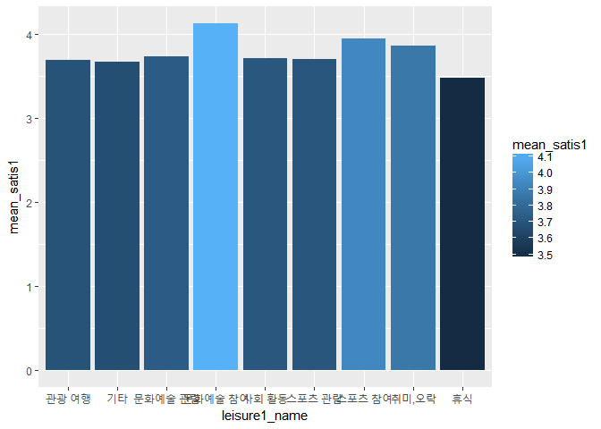

여가 종류와 무관하게 만족도는 모든 항목에서 비슷하게 나타났다. 근사하게나마 `문화예술 참여` 활동의 만족도가 가장 높았다.

### \[분석6\] 성별 및 여가 인원별 만족도

#### 변수 검토 및 전처리

-   성별 변수

먼저 응답자의 성별을 파악하기 위해 응답자의 가구원 번호가 1일 때는 가구원1의 성별을, 응답자의 가구원 번호가 2일 때는 가구원2의 성별을 부여하였다. 응답자의 나이와 마찬가지로 3에서 6의 가구원 번호를 가진 응답자의 성별은 모두 결측처리하였다.

``` r
welfare$respondent_sex <- ifelse(welfare$respondent == 1, welfare$sex1,
                                 ifelse(welfare$respondent == 2, welfare$sex2, NA))
table(welfare$respondent_sex)
```

    ## 
    ##    1    2 
    ##  801 2180

``` r
#결측치 확인
table(is.na(welfare$respondent_sex))
```

    ## 
    ## FALSE  TRUE 
    ##  2981    38

값의 의미를 이해하기 쉽도록 1 또는 2의 숫자로 표기된 응답자의 성별 항목에 이름을 부여했다.

``` r
welfare$respondent_sex <- ifelse(welfare$respondent_sex == 1, "male", 
                                 ifelse(welfare$respondent_sex == 2, "female", NA))
table(welfare$respondent_sex)
```

    ## 
    ## female   male 
    ##   2180    801

``` r
#결측치 확인
table(is.na(welfare$respondent_sex))
```

    ## 
    ## FALSE  TRUE 
    ##  2981    38

``` r
qplot(welfare$respondent_sex)
```

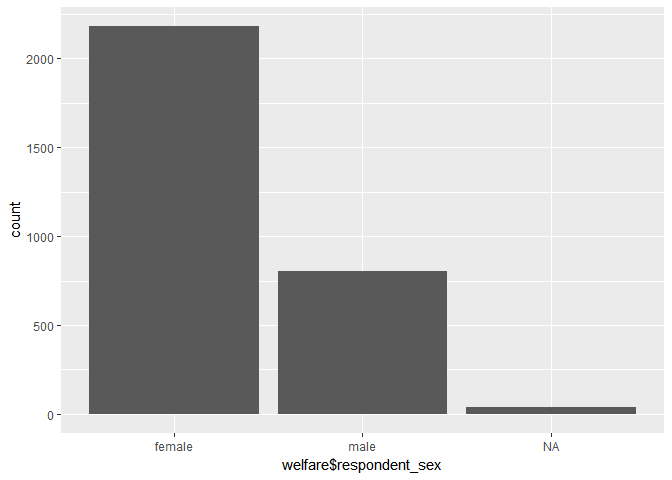

#### 변수 간 관계 분석: 성별, 여가인원, 만족도

``` r
sex_leisure <- welfare %>% 
  filter(!is.na(satisfy) & !is.na(respondent_sex)) %>% 
  group_by(aloneornot, respondent_sex) %>% 
  summarise(mean_satis = mean(satisfy))
ggplot(data = sex_leisure, aes(x = aloneornot, y = mean_satis, fill = respondent_sex)) + 
  geom_col(position = "dodge")
```

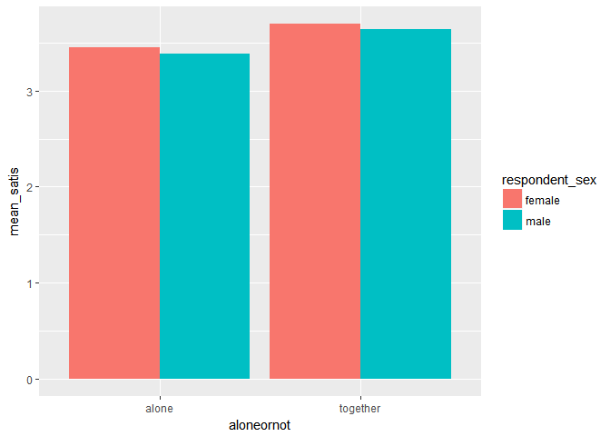

성별에 관계없이 함께하는 여가에서 조금 더 높은 만족도를 보였다.

### 4. 총평

모든 분석에서 만족도는 변수에 관계없이 비슷한 정도를 보였다. 다만 현재의 트렌드와는 달리 다른 사람과 함께할 때 다소 높게 나타났다. 때문에 혼자 하는 여가보다는 `가족`과 함께 `문화예술 참여 활동`을 한다면 여가활동의 만족도를 조금이나마 높일 수 있을 것이다.

------------------------------------------------------------------------

Ⅲ. 논의
-------

### 1. 한계점

혼영, 혼술 등 홀로 즐기는 문화가 정확히 언제부터 우리 사회에서 하나의 트렌드로 자리 잡은지는 알 수 없었으나, 트렌드를 반영한 프로그램을 제작하는 풍조를 통해 알아보자면 tvN 드라마 <혼술남녀>의 첫 방영이 2016년 10월경이었다. 이를 고려하면 2015년의 데이터는 아직 혼자 하는 여가에 대한 인식이 다소 부정적일 수 있을 시기라 생각한다. 또 대부분의 응답자가 가구주에 해당, 중장년층에 밀집되어 있어 젊은 세대의 응답 값이 부족했다는 점이 분석 결과의 단조로움으로 나타난 것도 같다.

### 2. 추후 분석 방향

2016년 이후의 데이터를 쓰되 최대한 다양한 응답자의 속성(특히 연령)이 드러나는 데이터가 있다면 결과가 보다 흥미롭게 나타날 것 같다.
